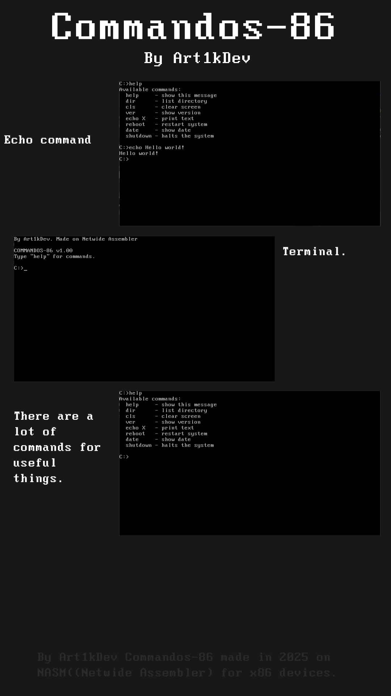

# Commandos-86

**Commandos-86** is an operating system written entirely in NASM.

# Information
Developer - Art1kDev;

Written in: NASM(Netwide Assembler);

lines of code: 300~;

version 1.00

# Commands
help - show help panel;

dir - check directory;

cls - clear all message;

ver - show system version;

echo (Text) - print your text;

reboot - restart system;

date - show date;

shutdown - power off system
